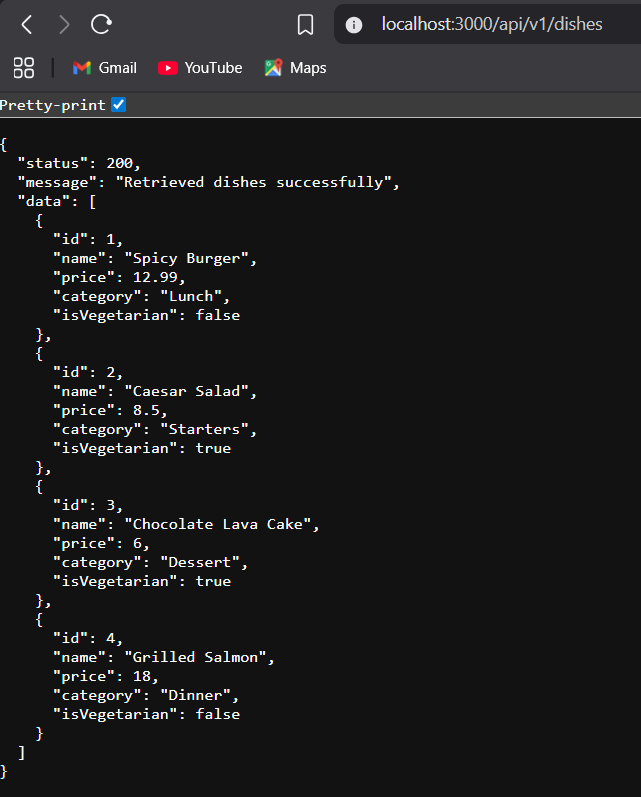

# RESTful API Activity - John Ryan P. Rodelas

## Best Practices Implementation

**1. Environment Variables:**
- Why did we put `BASE_URI` in `.env` instead of hardcoding it?
- Answer: Because environment variables let us change configuration (like base routes and ports) without editing source code. This makes the app easier to deploy to different environments (local, staging, production) and avoids repeating values across files.

**2. Resource Modeling:**
- Why did we use plural nouns (e.g., `/transactions`) for our routes?
- Answer: Plural nouns represent a collection of resources. It’s a common REST convention, so `/transactions` clearly means “all transactions,” and `/transactions/:id` means “one transaction from that collection.”

**3. Status Codes:**
- When do we use `201 Created` vs `200 OK`?
- Answer: Use `201 Created` when a new resource is successfully created (POST). Use `200 OK` when a request succeeds and returns a normal response (GET/PUT).

- Why is it important to return `404` instead of just an empty array or a generic error?
- Answer: A `404 Not Found` clearly tells the client that the requested resource (or filtered result) doesn’t exist. It helps debugging and lets the frontend handle “not found” cases properly.

**4. Testing:**
- (Paste a screenshot of a successful GET request here)

---

## Quick Start

1) Install dependencies:
```bash
npm install
```

2) Create your `.env` file using the example:
```bash
copy .env.example .env
```

3) Run the server:
```bash
npm run dev
```

## Endpoints (BASE_URI=/api/v1)

- `GET /api/v1/transactions`
  - Optional query: `type`, `minAmount`, `maxAmount`, `q`
  - Example: `/api/v1/transactions?type=expense&minAmount=100&q=rent`

- `POST /api/v1/transactions`
  - Body example:
```json
{
  "description": "Load",
  "amount": 50,
  "type": "expense",
  "date": "2023-10-11"
}
```

- `PUT /api/v1/transactions/:id`
- `DELETE /api/v1/transactions/:id`
