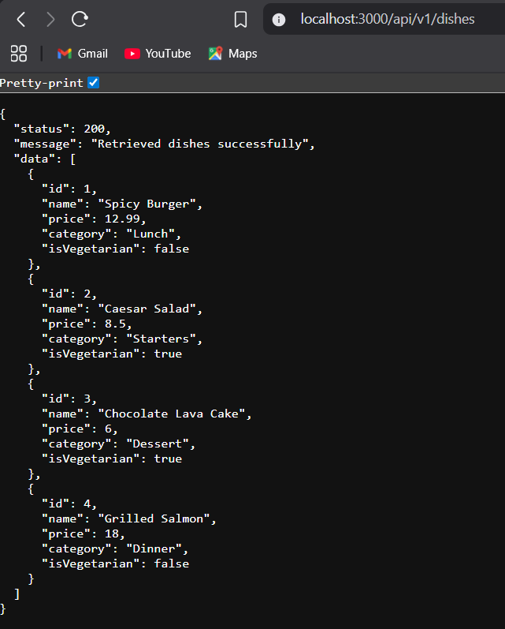

# RESTful API Activity - John Ryan P. Rodelas

## Best Practices Implementation

**1. Environment Variables:**
- Why did we put `BASE_URI` in `.env` instead of hardcoding it?
- Answer: Because environment variables let us change configuration (like base routes and ports) without editing source code. This makes the app easier to deploy to different environments (local, staging, production) and avoids repeating values across files.

**2. Resource Modeling:**
- Why did we use plural nouns (e.g., `/transactions`) for our routes?
- Answer: Plural nouns represent a collection of resources. It’s a common REST convention, so `/transactions` clearly means “all transactions,” and `/transactions/:id` means “one transaction from that collection.”

**3. Status Codes:**
- When do we use `201 Created` vs `200 OK`?
- Answer: Use `201 Created` when a new resource is successfully created (POST). Use `200 OK` when a request succeeds and returns a normal response (GET/PUT).

- Why is it important to return `404` instead of just an empty array or a generic error?
- Answer: A `404 Not Found` clearly tells the client that the requested resource (or filtered result) doesn’t exist. It helps debugging and lets the frontend handle “not found” cases properly.

**4. Testing:**
- (Paste a screenshot of a successful GET request here)

---

# Database Design Explanation

## Why did I choose to Embed the Review / Tag / Log?

I chose to **embed** the Review, Tag, or Log because they are directly related to a specific main document and are not meant to exist independently.

### Reasons:

1. **Strong Relationship**
   Reviews, tags, and logs are tightly connected to a specific item (e.g., hotel, dish, transaction). They do not need to exist on their own.

2. **Faster Data Retrieval**
   Since the data is embedded inside the main document, everything can be retrieved in a single query. This improves performance and reduces complexity.

3. **Small and Controlled Data**
   These fields usually contain limited information and are not expected to grow excessively large.

4. **Simpler Structure**
   Embedding avoids unnecessary collections and keeps the database design straightforward.

**Summary:**  
Embedding is best when the data is closely related, small in size, and always accessed together with the parent document.

---

## Why did I choose to Reference the Chef / User / Guest?

I chose to **reference** the Chef, because they are independent entities that can exist separately from a single transaction or record.

### Reasons:

1. **Independent Entity**
   A Chef, User, or Guest has their own complete information and can exist even without a specific booking or transaction.

2. **Reusability**
   - One User can create multiple transactions.
   - One Chef can prepare multiple dishes.
   - One Guest can make multiple bookings.

3. **Avoid Data Duplication**
   Referencing prevents repeating the same user or chef information in multiple documents. This makes updates easier and keeps the data consistent.

4. **Scalability**
   As the system grows, referencing allows better organization and management of large amounts of data.

## Project Checklist

- [/] Code runs via `npm run dev` with no errors.
- [/] Registration and Login endpoints are functional.
- [/] Middleware correctly blocks unauthorized users.
- [/] GitHub Repo link submitted.
- [/] README.md updated with answers to the required questions.

---

## README.md Questions

### 1. Authentication vs Authorization

**What is the difference between Authentication and Authorization in our code?**

**Answer:**

Authentication is the process of verifying the identity of a user. In our code, this happens when a user logs in using their email and password. The system checks if the credentials match the data stored in the database.

Authorization, on the other hand, determines what the authenticated user is allowed to access. After logging in, a JSON Web Token (JWT) is generated and sent to the client. When the user tries to access a protected route, the middleware checks the token to confirm if the user has permission to access that resource.

---

### 2. Security (bcrypt)

**Why did we use bcryptjs instead of saving passwords as plain text in MongoDB?**

**Answer:**

We use bcryptjs to hash passwords before saving them in the database. Hashing converts the password into a secure encrypted format that cannot easily be reversed.

Saving passwords as plain text is dangerous because if the database is compromised, attackers would immediately see all user passwords. With bcryptjs, even if the database is leaked, the hashed passwords make it extremely difficult for attackers to recover the original passwords.

---

### 3. JWT Structure

**What does the protect middleware do when it receives a JWT from the client?**

**Answer:**

The protect middleware checks if the request contains a valid JWT token in the authorization header. If a token is present, the middleware verifies it using the JWT secret key.

If the token is valid, the middleware decodes the token to get the user information and allows the request to continue to the protected route. If the token is missing or invalid, the middleware blocks the request and returns an unauthorized access error.

---

## Technologies Used

- Node.js
- Express.js
- MongoDB
- Mongoose
- bcryptjs
- JSON Web Token (JWT)

---